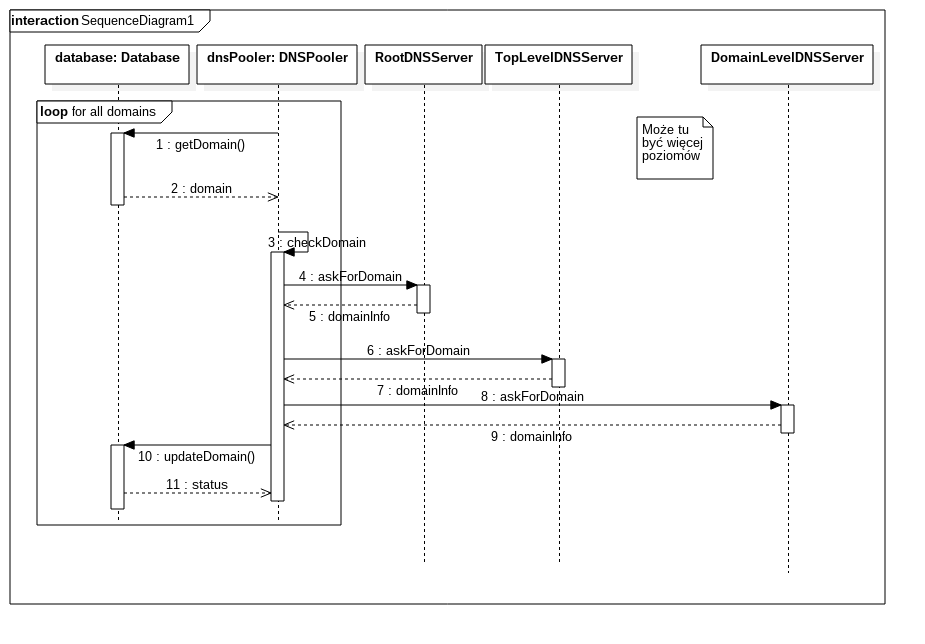
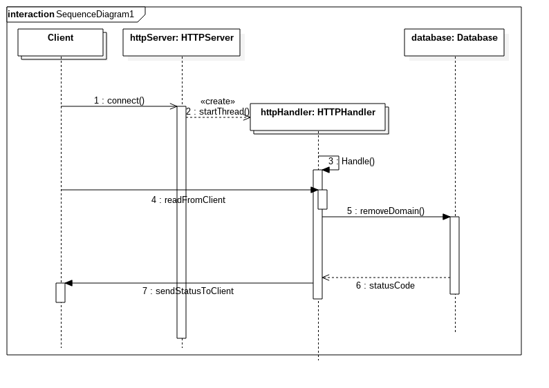

# TIN Projekt
## DNS Checker - Cykliczny analizator dostępności domen
## Dokumentacja ostateczna

#### Skład zespołu projektowego
- Radosław Załuska
- Konrad Czarnota
- Wiktor Kozakowski
- Aleksander Brodowicz

#### Treść zadania
> Celem zadania jest implementacja serwera, który cyklicznie będzie odpytywał
> systemy DNS dla dynamicznie zarządzanej listy domen. Odpytanie serwerów DNS
> będzie zrealizowane całkowicie iteracyjnie, tj. rozpoczynając od podanego
> "Root name server-a" poprzez wszystkie kolejne poziomy adresu domenowego.
> Zarządzanie listą domen oraz odbieranie wyników będzie zrealizowane z
> wykorzystaniem protokołu HTTP i notacji/składni JSON.

## Środowisko
Serwer będzie działał w środowisku systemu Linux. Do implementacji będzie użyty
język C++11. Obsługa wątków będzie zrealizowana za pomocą klasy std::thread.
Synchronizacja w dostępie do danych współdzielonych będzie odbywać się za pomocą
klasy std::mutex (obie klasy pochodzą ze standardu C++11).

##### Spis bibliotek pomocniczych
- [jsoncpp](https://github.com/open-source-parsers/jsoncpp) - parser json
- [Catch](https://github.com/philsquared/Catch) - testowanie

### Budowanie
Projekt będzie budowany za pomocą narzędzia cmake zapewniającego sprawdzenie
dostępności wymaganych bibliotek w systemie i automatyczne tworzenie plików
Makefile w przypadku spełnienia zależności.

### Testowanie
Kluczowe elementy programu zostaną przetestowane za pomocą biblioteki
wspomagającej testy jednostkowe w C++ [Catch](https://github.com/philsquared/Catch).
Do testów integracyjnych zostanie użyty prosty klient http napisany w Pythonie.

## Zakładana funkcjonalność
- śledzenie dostępności wskazanych domen
- możliwość dodawania nowych domen do śledzenia za pomocą zatania HTTP
- możliwość pobierania statusu domen przez zapytania HTTP
- możliwość usuwania domen ze zbioru śledzonych za pomocą zapytania HTTP

## Architektura programu

### Lista podstawowych klas
- TCPSocket
- UDPSocket
- HTTPServer
- HTTPHandler
- HTTPPacket
- Database
- DNSPacket
- DNSPooler
- Logger
- Configuration

\newpage
### Schemat działania


Dla każdego nowego połączenia uruchamiany jest wątek HTTPHandler obsługujący to
połączenie. Liczba wątków działających w danym momencie na rzecz klientów
serwera HTTP jest konfigurowalna w pliku cfg. Aplikacja reguluje możliwość
uruchomienia nowego wątku poprzez użycie semafora którego wartość jest ustawiona
początkowo na ilość wątków podaną w konfiguracji. Stworzenie nowego wątku
zmniejsza wartość semafora o 1, a zakończenie pracy wątku zwiększa tę wartość.

#### Start aplikacji
1. przełączenie programu w tryb deamona i wpisanie pidu do pliku
dns-checker.pid
2. podłącznie signal handlera dla SIGUSR1
1. sprawdzenie czy plik kofiguracji istnieje, jeśli nie to program kończy
   dzałanie i wypisuje komunikat do logu
2. odczytanie konfiguracji i umieszczenie jej w instalacji klasy Configuration
3. utworzenie obiektu Database w którym na początku nie ma domen do śledzienia
4. uruchomienie wątku HTTPServer
    - bind adresu i portu wskazanego w konfiguracji
    - rozpoczęcie nasłuchiwania
5. uruchomienie wątku DNSPooler
    - wejście do pętli cyklicznego odpytywana
    - uśpienie na czas określony w kofiguracji jako interval

\newpage
#### Jeden cykl pracy DNSPoolera


Co określony czas podany w kofiguracji DNSPooler odświeża status wszystkich
domen śledzonych przez aplikację.
```
Dla każdej domeny (D):
    a:
    pula\_serwerów <= [Root serwery DNS]
    Dla każdego serwera (S) z puli:
        b:
        Zapytaj serwer o domenę D
        a) Jeśli serwer jest autorytatywny dla domeny to zaznaczmy w bazie
        danych że domena istnieje i przechodzimy do następnej domeny
        b) Jeśli serwer nie zna domeny ale zna serwery które są autorytatywne dla
        kolejnej strefy do której należy domena (np dla domeny elka.pw.edu.pl
        serwery Root wskażą że znają serwery odpowiadające za strefę .pl
        a w następnym obrocie pętli serwery odpowiadające za .edu.pl) to:
                pula\_serwerów = [serwery znające następną część domeny]
                goto b.

        c) Jeśli domena jest nieznana to zapisujemy to w bazie danych i
           przechodzimy do odświerzenia następnej domeny (goto a)
```

\newpage
#### Dodanie domeny do śledzienia przez użytkownika


1. użytkownik łączy się do HTTPServera
2. serwer tworzy nowy wątek dla użytkownika (HTTPHandler)
3. użytkownik wysyła zapytanie HTTP POST z nagłówkiem HTTP Content-Type:
   application/json, url nie ma znaczenia i jest ignorowany, w ciele zapytania
   powinien być JSON postaci
    ```js
    {"command":"add", "domains": ["google.com", "elka.pw.edu.pl"]}
    ```
4. HTTPHandler odbiera rządanie i jeśli jest poprawna to dodaje zadane domeny do
   bazy danych
5. HTTPHandler buduje odpowiedź postaci
    ```js
    {"task": {"command":"add", "domains": ["google.com", "elka.pw.edu.pl"]},
    "result": [
    {"domain":"google.com", "status":"ok"},
    {"domain":"elka.pw.edu.pl", "status": "alreadyInDatabase"}]}
    ```
    i odsyła pakiet HTTP do użytkownia
6. HTTPHandler rozłącza się z użytkownikiem (close(socket))
7. wątek obsługujący użytkownika kończy działanie opuszczjąc funkcję obsługi

\newpage
#### Usuwanie domen przez użytkownika


1. użytkownik łączy się do HTTPServera
2. serwer tworzy nowy wątek dla użytkownika (HTTPHandler)
3. użytkownik wysyła zapytanie HTTP POST z nagłówkiem HTTP Content-Type:
   application/json, url nie ma znaczenia i jest ignorowany, w ciele zapytania
   powinien być JSON postaci
    ```js
    {"command":"remove", "domains": ["google.com", "elka.pw.edu.pl"]}
    ```
4. HTTPHandler odbiera rządanie i jeśli jest poprawna to usuwa zadane domeny z bazy danych
5. HTTPHandler buduje odpowiedź postaci
    ```js
    {"task": {"command":"remove", "domains": ["google.com", "elka.pw.edu.pl"]},
    "result": [
    {"domain":"google.com", "status":"ok"},
    {"domain":"elka.pw.edu.pl", "staus": "not_in_database"}]}
    ```
    i odsyła pakiet HTTP do użytkownia
6. HTTPHandler rozłącza się z użytkownikiem (close(socket))
7. wątek obsługujący użytkownika kończy działanie opuszczjąc funkcję obsługi

\newpage
#### Odpytanie o status domen przez użytkownika


1. użytkownik łączy się do HTTPServera
2. serwer tworzy nowy wątek dla użytkownika (HTTPHandler)
3. użytkownik wysyła zapytanie HTTP POST z nagłówkiem HTTP Content-Type:
   application/json, url nie ma znaczenia i jest ignorowany, w ciele zapytania
   powinien być JSON postaci
    ```js
    {"command":"query", "domains": ["google.com", "elka.pw.edu.pl", "wp.pl", "github.com"]}
    ```
4. HTTPHandler odbiera rządanie i wyszukuje zadane domeny w bazie danych oraz
   gdy je znajdzie pobiera ich status
5. HTTPHandler buduje odpowiedź postaci
    ```js
    {"task": {"command":"query", "domains": ["google.com", "elka.pw.edu.pl", "wp.pl"]},
    "result":
    [
    {"domain":"google.com", "status":"ok", "timestamp": 1465388431, "ip": "134.32.23.39"},
    {"domain":"elka.pw.edu.pl", "staus": "no_in_database", timestamp: 0},
    {"domain":"wp.pl", "staus": "unreachable", "timestamp": 1465388587},
    {"domain":"github.com", "staus": "unknown", "timestamp": 1465389587}
    }
    ```
    i odsyła pakiet HTTP do użytkownia
6. HTTPHandler rozłącza się z użytkownikiem (close(socket))
7. wątek obsługujący użytkownika kończy działanie opuszczjąc funkcję obsługi

#### Dostęp do bazy danych domen
Wszystkie dostępy do zapisu, odczytu i usuwania są chronione mutexem.

#### Zakończenie działania aplikacja
Aby zakończyć działanie aplikacja należy wydać w terminalu polecenie
```bash
cd TIN
kill -SIGUSR1 $(cat dns-checker.pid)
```
Program po otrzymaniu sygnału zakończy wszystkie wątki i wpisze do logu
informację o wyłączaniu.

### Przykłady zapytań JSON
#### Dodanie nowego serwera/serwerów
```js
{"command":"add", "domains": ["google.com", "elka.pw.edu.pl"]}
```
##### Odpowiedź
```js

"result":
    [
        {"domain":"google.com", "status":"ok"},
        {"domain":"elka.pw.edu.pl", "status": "ok"}
    ]
}
```
#### Usunięcie serwera/serwerów
```js
{"command":"remove", "domains": ["google.com", "elka.pw.edu.pl"]}
```
##### Odpowiedź
```js
{"task": {"command":"remove", "domains": ["google.com", "elka.pw.edu.pl"]},
"result":
    [
        {"domain":"google.com", "status":"ok"},
        {"domain":"elka.pw.edu.pl", "staus": "no_in_database"} //próba usunięcia
        //domeny która nie była na serwerze
    ]
}
```
#### Odpytanie o status serwerów
```js
{"command":"query", "domains": ["google.com", "elka.pw.edu.pl", "wp.pl", "github.com"]}
```
##### Odpowiedź
```js
{"task": {"command":"query", "domains": ["google.com", "elka.pw.edu.pl", "wp.pl"]},
"result":
    [

        //domena jest znana na serwerze i odpowiada na zapytania
        {"domain":"google.com", "status":"ok", "timestamp": 1465388431, "ip": "134.32.23.39"},
        // domena jest niezanana na serwerze
        {"domain":"elka.pw.edu.pl", "staus": "no_in_database", "timestamp": 0},
        //domena jest znana na serwerze ale nie odpowiada na zapytania
        {"domain":"wp.pl", "staus": "unreachable", "timestamp": 1465388587},
        //domena jest znana na serwerze ale nie była jeszcze odpytywana lub
        // konfiguracja siecowa serwera uniemożliwia jej odpytanie
        {"domain":"github.com", "staus": "unknown", "timestamp": 1465389587}
    ]
}
```

## Sposób instalacji
### Budowanie ze źródeł
#### Ubuntu 14.04
```bash
sudo apt-get install cmake libjsoncpp-dev git build-essential
git clone https://github.com/Aerial94/TIN
cd TIN
mkdir build
cmake ..
make
```

### Uruchomienie po zbudowaniu
```bash
cd TIN
cd build
./domain-checker
```
#### Parametry programu
- -f - program nie odseparowuje się od terminiala i nie staje się deamonem
systemowym - przydatne gdy chcemy mieć możliwość jego szybkiego zamknięcie
poprzez Ctrl+C
- -h - wypisuje krótki komunikat pomocy
- -v - informacja o wersji programu

Parametry programu są obsługiwane przez funkcję getopt() biblioteki GNU C.

#### Tryb deamon
Program wywołany bez parametru -f przechodzi na drugi plan terminala i odłącz
się od niego. W takim przypadku aby zakończyć jego działanie możemy się posłużyć
plikiem dns-checker.pid utorzonym w katalogu programu. Jest w nim zapisany PID
procesu dns-checker. Aby zatrzymać program wydajemy polecenie:
```bash
kill -SIGTERM $(cat dns-checker.pid)
```

## Zmiana parametrów programu
W programie będzie można skonfigurować następujące parametry:

- adres interfejsu sieciowego na którym będzie nasłuchiwał serwer http (lub *
oznaczająca wszystkie interfejsy - INADDR\_ANY)
- port na którym będzie dostępna usługa http
- interwał pomiędzy cyklicznymi odpytaniami serwerów DNS o domenę
- timeout na przysłanie danych od klienta do serwera http po rozpoczęciu obsługi
(aby nie zabierać zasobów przez "wiszące" połączenia)
- maksymalna ilość wątków HttpHandler obsługujących klientów serwera http

Program będzie konfigurowany poprzez plik cfg w formacie json o nazwie
config.json. Podczas uruchamiania plik ten będzie musiał być umieszczony w tym
samym katalogu co aplikacja.

### Przykładowy plik konfiguracyjny
config.json
```js
{
    "httpServer": {
        "address" : "127.0.0.1",
        "port" : "8080"
        "readTimeout" : "60", //timeout 1 minuta
        "maxThreads" : "10"
    }
    "dnsPooler" : {
        "interval" : "600" //odpytanie co 10 minut
    }
    "logLevel": "DEBUG"
}
```
#### Opis konfiguracji
```js
httpServer.address // adres ip interfejsu na którym ma być dostępna usługa serwera HTTP
httpServer.port // port TCP na którym ma być dostępna usługa serwera HTTP
httpServer.readTimeout // czas oczekiwania na komunikat od klienta po połączeniu
                       // po którego przekroczeniu serwer się odłącza
                       // (w sekundach)
httpServer.maxThreads // maksymalna ilość wątków HTTPHandler mogących działać w
                      // jednym momencie
dnsPooler.interval // definiuje co jaki czas mo odbyć się sprawdzenie
                   // domen (w sekundach)
logLevel // poziom logowania
logLevel = INFO // Podstawowe informacje o pracy programu
logLevel = WARNING // To samo co INFO a dodatkowo logowanie sytuacji nietypowych
                   // (błędne pakiety itp)
logLevel = DEBUG // to samo co WARNING a dodatowo dokładne informacje na
                 // temat pracy programu przydatne do debugowania (zawartość
                 // pakietów itp)
```

## Sytuacje wyjątkowe

- próba wykonania operacji bind dla uprzywilejowanego numeru portu bez uprawnień
użytkownika root, program kończy działanie w wyniku tego błędu
- brak dostępu do internetu dla interfejsu sieciowego wybranego do odpytywania
serwerów DNS - następuje dodanie wpisu do logu, program kontynuuje swoje
działanie w oczekiwaniu na pojawienie się połączenia
- nieprawidłowe zapytanie do serwera http (nieprawidłowe nagłówki http lub dane
w json - sytuacja zostaje zalogowana, a nieprawidłowy pakiet odrzucony
- przepełnienie kolejki podłączonych użytkowników oczekujących na obsługę -
informacja o tym zostaje dodana do logów
- nieodnalezienie plik konfiguracyjnego w katalogu w którym jest program
- nieprawidłowy format pliku konfiguracyjnego - błąd składniowy lub plik
niekompletny - program kończy działanie wypisując komunikat o błędzie

## Format logów
Wszystkie logi są zapisywane do pliku log.txt w katalogu programu
```
DATA CZAS [WAŻNOŚĆ_LOGU] (NAZWA_MODUŁU) NAZWA_BŁĘDU OPIS
WAŻNOŚĆ_LOGU => INFO | DEBUG | WARNING
```

### Przykładowe logi
```
2016.04.09 11:20:17 [INFO] (Main) Application started
2016.04.09 14:32:49 [WARNING] (HTTPHandler) Bogus packet from 127.0.0.1:8764 dropped
2016.04.09 18:14:58 [DEBUG] (Main) Main pid is 1432, saving to file dns-checker.pid
```
